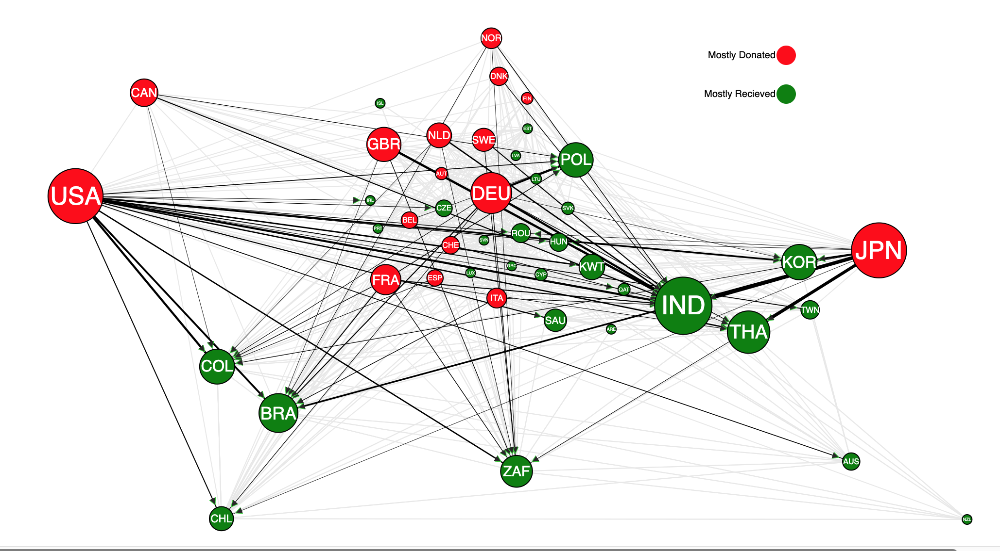

# Geo Node-Link Example

An example of how to use geographic data to create a node-link visualization with D3.js



## Disclaimer

I do not give permission to use this in any plagiaristic fashion for a similar assignment. The code can be referenced, but not **copied**. It is publicly available as an example of how to make a node link diagram which has geographic features.

## Context

This was a school project for my Visualization class which asked to use the `Aid-Data` dataset to:

```text
Create an overview of the relationships between countries:

1) Major donors and receivers and who they send to / receive from, respectively.

2) Groups of countries that share similar behavior.
```

## Explanation

Originally, I decided to use a node link diagram with force direction, but after implementing the force simulation similarly to the provided D3.js network sample, I found that a lot of additional work had to be done to compensate for the large amount of links and nodes. Therefore, I highlighted only the lines which represented donations that were in the top 20th percentile of the data and were only from mostly donating countries to mostly receiving countries (leaving the rest a light grey). I represented mostly donating countries and mostly receiving countries with the node colored red and green respectively. I encoded each donation's amount to the width of the line and the total amount donated and received (cash flow) to the size of each country’s node. Finally, I added arrows at the end of the lines to show directionality.
In addition, I preserved the relative geographic positions of the country nodes to improve viewer familiarity with the visual representation of the network. The way this was accomplished was by plotting each node at its geographic centroid and then pushing close nodes apart to avoid collision and clutter.
With this visualization, a viewer can determine the major donors and receivers by comparing node colors (mostly donor or receiver) and sizes (amount). Then one can follow the edges between nodes from their bases to their arrows to determine who sent to whom. Finally, they can quickly locate countries using their relative geographic positions and by reading the country code labels. As such, its easy to see that the United States donated to many countries, for example: India, which itself received from many other countries, including those in Europe.

## Code

The code should be easy enough to follow with comments and clear naming. A lot of it deals with data processing and grouping for statistical analysis. The rest deals with visualizing the data in D3.js. The geographic positioning of nodes is actually very straightforward--set the nodes' starting positions to the coordinates of its area's centroid:

```javascript
// sets initial x and y of nodes based on geoJSON data
function setNodeCentroid(data, geo) {
    data.nodes = data.nodes.map(d => {
        d.x = geo.centroids[d.id]['x']
        d.y = geo.centroids[d.id]['y']

        return d
    })

    return data
}
```

The force direction will repel nodes away from each other but the relative geographic position will be retained.

### Running the Code

You can serve this with hot reloading by running the `serve.sh` script. First, install `browser-sync` from npm:

`npm install -g browser-sync`

Note: `-g` installs globally

Then, make `serve.sh` executable by running:

 `chmod +x serve.sh`

Finally, navigate to `localhost:8080` to see the visualization.
